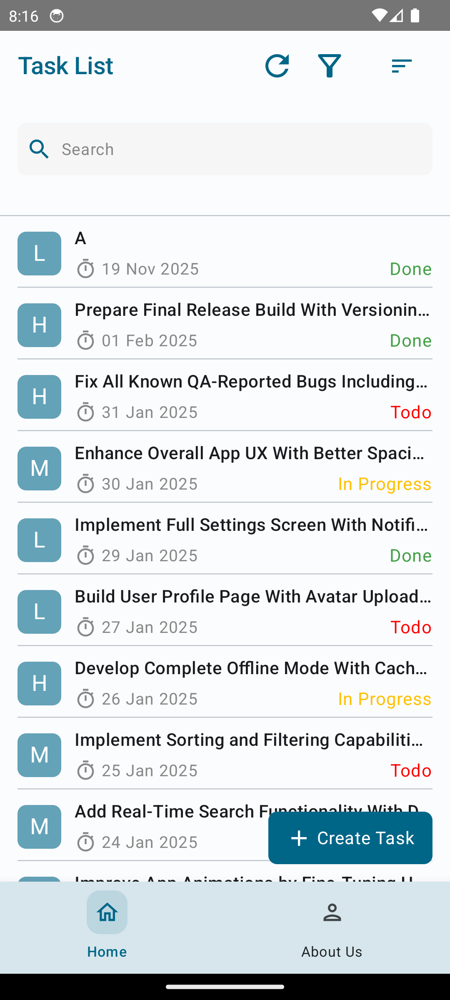
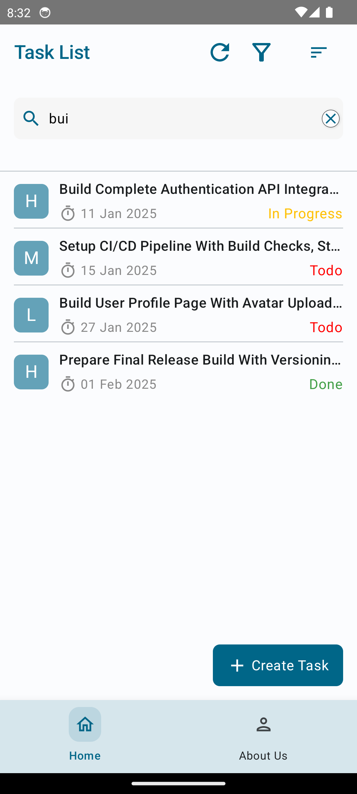
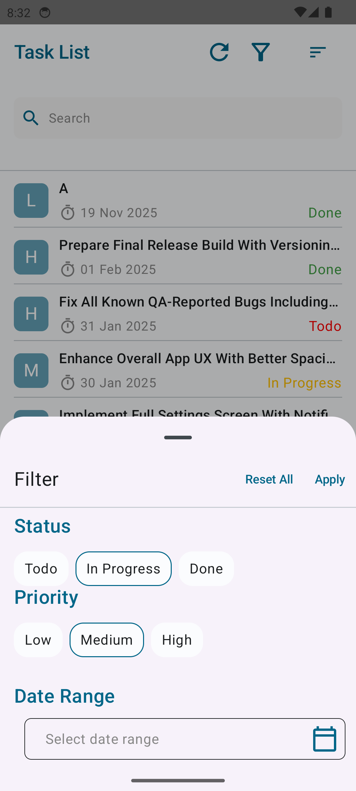
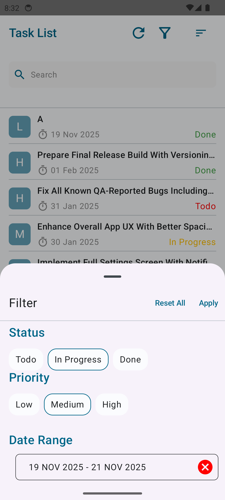
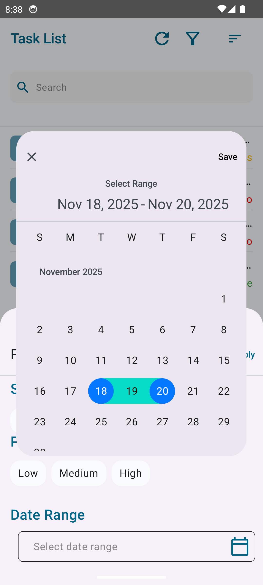
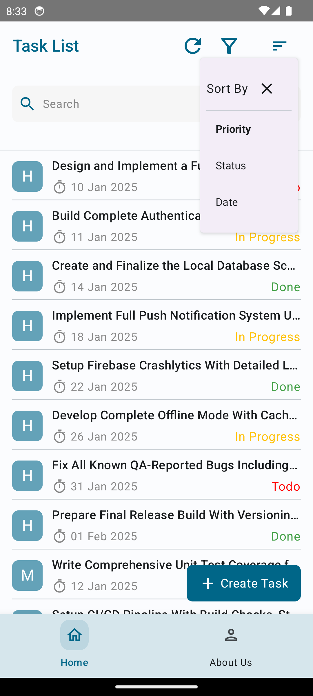
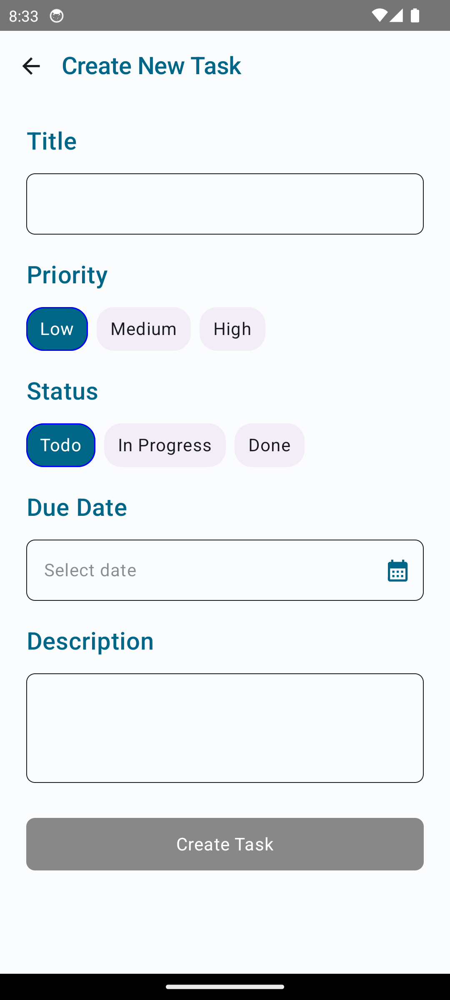
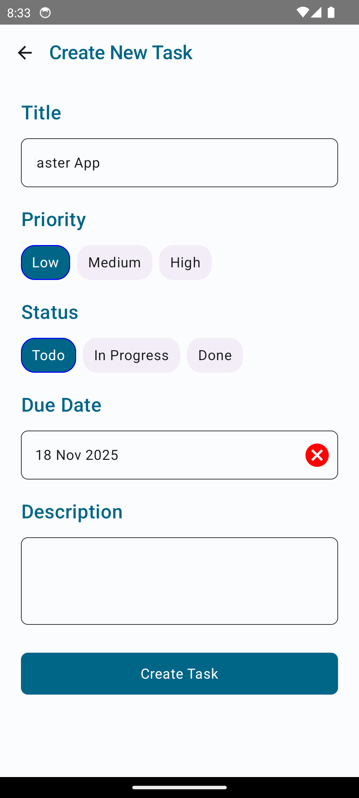
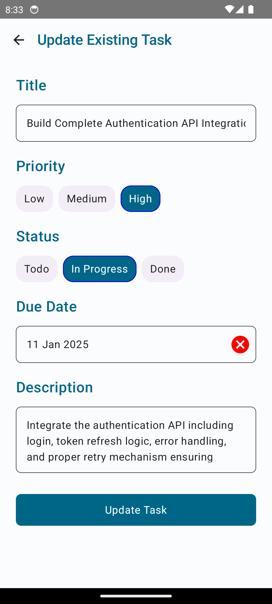

# 📝 Task Master App

A cross-platform task management application built with **Kotlin Multiplatform (KMP)** for shared business logic, currently focusing on a native **Android** UI experience.

I’m not so creative when it comes to creating new UI designs, so I took some help from the web for design and creating the app as per the requirements.
However, I tried to keep the codebase maintainable so that with minimal effort it’s possible to change the UI of any part, and it’s also easy to switch to a cross-platform UI (Compose Multiplatform) or implement native UI for each platform.

## 🧭 Table of Contents
* [✨ Features](#-features)
* [🔗 App Links](#-app-links)
* [📖 User Manual & Known Issues](#-user-manual--known-issues)
    * [How to Use](#how-to-use)
    * [Current Limitations](#current-limitations)
* [💻 Technical Details](#-technical-details)
    * [Architecture & Tech Stack](#architecture--tech-stack)
* [📸 Screenshots](#-screenshots)

---

## ✨ Features

* **CRUD Operations:** Easily **Create**, **Update**, and **Delete** tasks.
* **Reading and Filtering:** View tasks and apply advanced filters based on: Date, Status, Priority, Due Date or Due Date Range
* **Sorting:** Organize your task list by **Date**, **Status**, or **Priority**.

---

## 🔗 App Links

| Description       | Link                            |
|:------------------|:--------------------------------|
| **Video Preview** | \[https://youtu.be/gZka3n9K2rY] |
| **APK Download**  | \[ ]                     |
| **Latest Code and App**   | \[ checkout to the `dev` branch]  |

---

## 📖 User Manual & Known Issues

### How to Use

* **Creating a Task:** The create button remains **disabled** until a **task title** is entered.
* **Deleting a Task:** **Long press** on a task tile to bring up a confirmation dialog to delete.

### Current Limitations

* **Emulator Display:** In some emulators (e.g., macOS Android Emulator), the **shadows for dialogs and bottom sheets** may not display correctly, though they work fine on physical devices.
* **iOS Target Missing:** Direct currency functionality is currently **missing** in the planned iOS app, as the native iOS UI is not yet ready. This is planned for a future update.

---

## 💻 Technical Details

### Architecture & Tech Stack

| Component | Technology/Concept | Usage |
| :--- | :--- | :--- |
| **Shared Logic** | **KMM/KMP** | Used exclusively for **shared business logic**. The core data, domain, and UI-independent layers reside in `src/commonMain`. |
| **Android UI** | **Jetpack Compose** | Utilized for the **Android target only** to simulate a native Android UI behavior (as per requirement). UI code is isolated in `src/androidMain`. |
| **iOS UI** | **SwiftUI (Planned)** | **No iOS UI is currently present**. Planning to use native SwiftUI in the near future. |
| **Local Persistence** | **Room KMP** | Employed for reliable and local data persistence across platforms. |
| **Date Operations** | **Kotlinx-DateTime** | Used for all date-related operations due to its compatibility across JVM and non-JVM targets (like iOS), where standard Java time APIs are incompatible. |
| **Project Structure** | **Convention Plugins** | Used in the multi-module setup to remove redundancy and simplify dependency management. |
| **Architecture** | **Clean Architecture based** | The project is structured based on concepts near to or inspired by Clean Architecture for maintainability and separation of concerns. |

---

## 📸 Screenshots

A visual representation of the app's various screens:

* **List Screen**

* **Task Search** 

* **Task Filter**

* **Task Sort**

**Task Create Screen**

**Task Update Screen**
